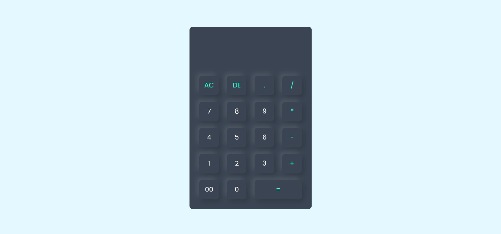

# JavaScript Calculator 🧮
A simple, responsive calculator built using HTML, CSS, and JavaScript. Supports basic arithmetic operations and provides a clean user interface.

🔗 [Live Demo](https://Nunna412.github.io/javascript-calculator/)

## 🖼️ Screenshot

## 📹 Demo

